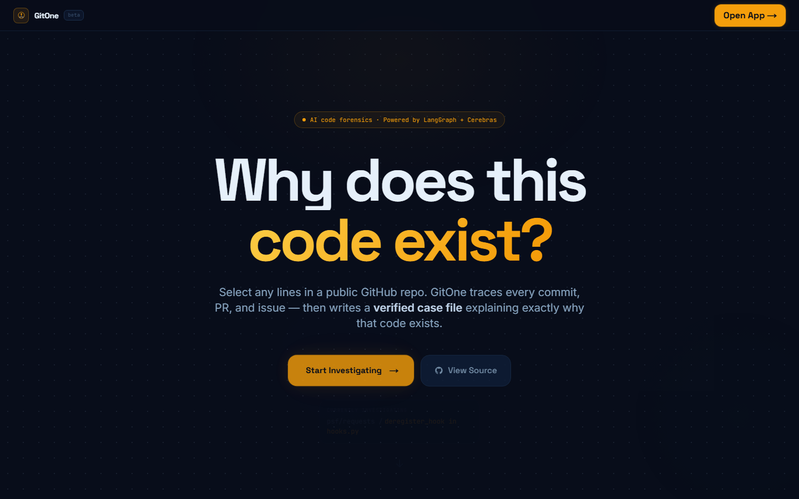
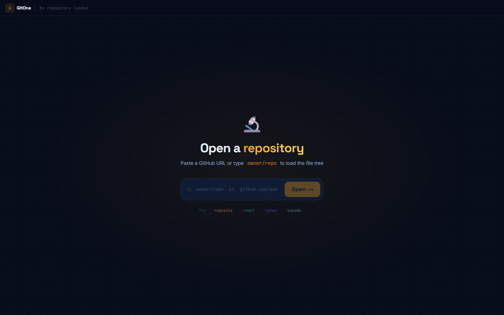
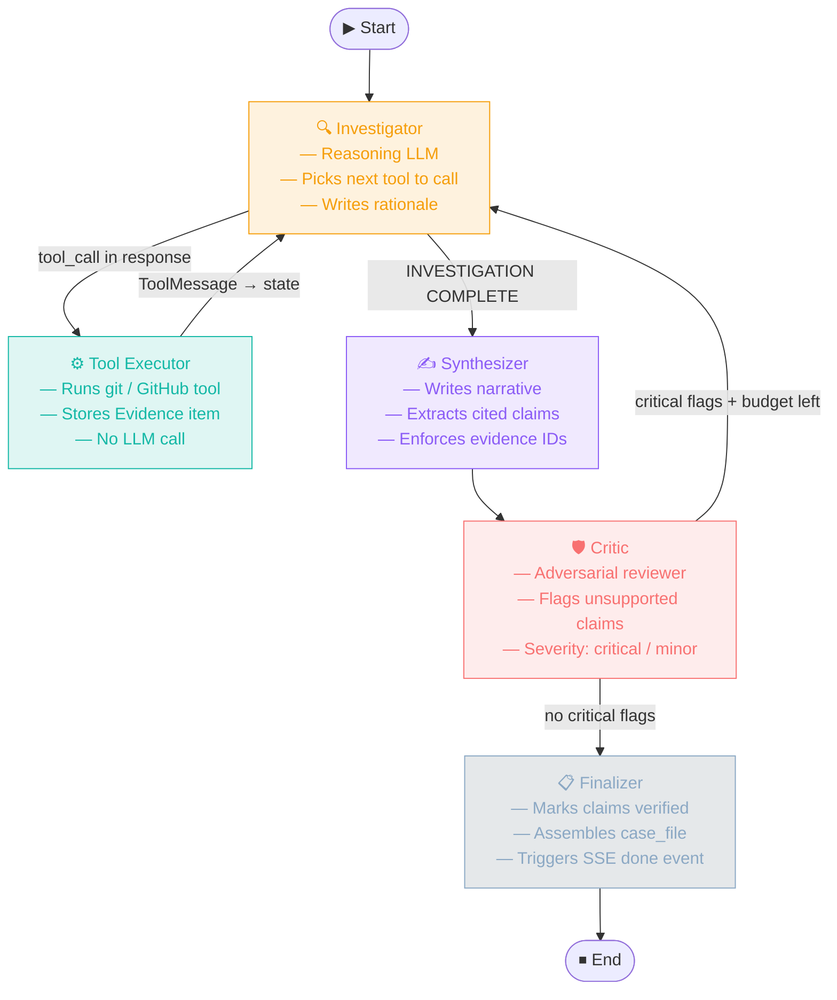
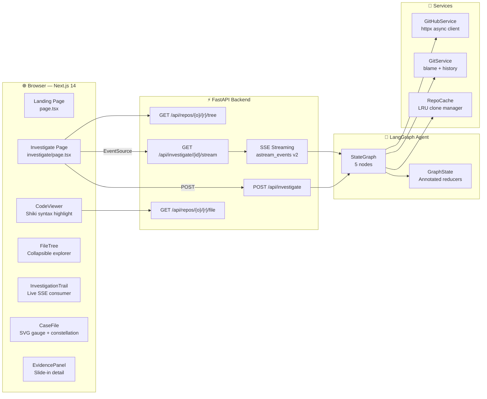

<div align="center">



<br/>

# GitOne

### AI-powered code forensics. Select any lines — get a cited case file.

[](https://python.org)
[](https://fastapi.tiangolo.com)
[](https://langchain-ai.github.io/langgraph/)
[](https://nextjs.org)
[](https://typescriptlang.org)
[](https://cerebras.ai)
[](LICENSE)

<br/>

**[Live Demo](https://gitone.vercel.app)** · **[Report a Bug](https://github.com/XPE-7/GitOne/issues)** · **[Request a Feature](https://github.com/XPE-7/GitOne/issues)**

</div>

---

## What is GitOne?

Ever looked at a piece of code and wondered *why* it's written that way? GitOne answers that question automatically.

Paste any public GitHub repo, select lines in any file, and a multi-agent AI system traces the full history — `git blame`, commit messages, linked PRs, referenced issues, discussion threads — and synthesizes a **verified, cited case file** explaining exactly why that code exists in its current form.

Every claim is grounded in real evidence. A separate critic agent checks each claim against the evidence it cites and flags anything that overreaches. Only verified claims make it into the final report.

<br/>



---

## How It Works

```
User selects lines  →  POST /api/investigate  →  LangGraph agent runs
                                                       │
                    ┌──────────────────────────────────┘
                    │   Investigator loops (up to 6x):
                    │     git blame → read commits → follow PR/issue refs
                    │
                    └──→  Synthesizer writes narrative + claims
                               │
                               └──→  Critic checks every citation
                                          │
                                    ┌─────┴──────┐
                              gaps found?    no gaps
                                  │              │
                             re-investigate   Finalizer
                                              assembles case file
                                                   │
                                    SSE streams live to browser
```

---

## Agent Pipeline

GitOne uses a **5-node LangGraph StateGraph** where nodes are Python async functions connected by conditional routing:



### The 9 Investigation Tools

| Tool | Source | What it fetches |
|---|---|---|
| `git_blame` | git (subprocess) | Which commit last touched each line, author, date |
| `get_commit` | GitPython | Full commit message, stats, changed files |
| `get_file_at_commit` | GitPython | File contents at any past revision |
| `get_file_history` | GitPython | All commits that touched a file (follows renames) |
| `search_commit_messages` | GitPython | Grep all commit messages for a keyword |
| `get_pull_request` | GitHub REST API | PR title, body, linked issues, merge SHA |
| `search_pull_requests` | GitHub REST API | Search PRs by keyword |
| `get_issue` | GitHub REST API | Issue body, labels, first 5 comments |
| `search_issues` | GitHub REST API | Search issues by keyword |

---

## Architecture



---

## Tech Stack

<table>
<tr>
<td valign="top" width="50%">

### Backend
- **FastAPI 0.115** — async Python web framework, SSE via `sse-starlette`
- **LangGraph 1.2** — stateful multi-agent graph with cycles and conditional routing
- **LangChain OpenAI** — `ChatOpenAI` pointed at Cerebras API (OpenAI-compatible)
- **Cerebras `gpt-oss-120b`** — fast inference LLM for investigator, synthesizer, critic
- **GitPython 3.1** — git history, commit reading, file tree
- **subprocess + porcelain** — `git blame --porcelain` parser for blame data
- **httpx** — async GitHub REST API client with rate limit tracking
- **pydantic-settings** — typed environment config from `.env`

</td>
<td valign="top" width="50%">

### Frontend
- **Next.js 14 App Router** — file-based routing, `'use client'` for interactive components
- **TypeScript** — end-to-end typing matching backend Pydantic schemas
- **Tailwind CSS** — custom design system (Void Terminal palette: gold / teal / violet)
- **Framer Motion** — `motion.path` SVG animations, spring physics, `AnimatePresence`
- **Shiki** — VS Code's syntax highlighter, `github-dark-dimmed` theme, client-side
- **Space Grotesk + JetBrains Mono** — display and code fonts via `next/font/google`

</td>
</tr>
</table>

---

## Interesting Engineering Decisions

**Annotated list reducers in LangGraph state**

```python
# Without this, each node return OVERWRITES the list.
# Annotated + operator.add tells LangGraph to APPEND instead.
evidence: Annotated[list[Evidence], operator.add]
```

**Tool factory pattern — per-investigation context closure**

```python
# Each investigation gets tools closed over ITS owner/repo.
# No global state, fully isolated, thread-safe.
tools = make_tool_registry(git_svc, github_svc, "psf", "requests")
```

**Shiki line extraction via DOMParser, not regex**

```typescript
// Regex (.*?) is lazy — stops at first </span> inside the line (a token span).
// DOMParser handles arbitrarily nested tags correctly.
const doc = new DOMParser().parseFromString(html, 'text/html')
const lines = doc.querySelectorAll('span.line')
```

**SSE pattern: POST first, then GET stream**

```
EventSource only supports GET — can't send a request body.
Solution: POST /api/investigate  → get investigation_id (12-char UUID)
          GET  /api/investigate/{id}/stream  → EventSource
```

---

## Project Structure

```
GitOne/
├── backend/
│   ├── app/
│   │   ├── agents/
│   │   │   ├── graph.py      ← LangGraph StateGraph wiring + routing
│   │   │   ├── nodes.py      ← 5 agent nodes (Investigator, ToolExecutor,
│   │   │   │                   Synthesizer, Critic, Finalizer)
│   │   │   ├── prompts.py    ← System prompts (one per node)
│   │   │   └── state.py      ← GraphState TypedDict + Annotated reducers
│   │   ├── api/
│   │   │   ├── routes.py     ← 4 endpoints with input validation
│   │   │   └── streaming.py  ← astream_events → typed SSE payloads
│   │   ├── services/
│   │   │   ├── repo_cache.py    ← async LRU clone manager
│   │   │   ├── git_service.py   ← git blame, commits, file history
│   │   │   └── github_service.py ← GitHub REST API client
│   │   ├── tools/
│   │   │   ├── git_tools.py     ← 6 LangChain @tool wrappers
│   │   │   ├── github_tools.py  ← 3 LangChain @tool wrappers
│   │   │   ├── references.py    ← #123 / GH-123 reference extractor
│   │   │   └── registry.py      ← make_tool_registry() factory
│   │   ├── config.py         ← pydantic-settings
│   │   ├── main.py           ← FastAPI app + CORS + logging
│   │   └── models/schemas.py ← request/response Pydantic models
│   ├── tests/
│   │   ├── smoke_tools.py    ← test all 9 tools without LLM
│   │   └── smoke_agent.py    ← run full investigation in terminal
│   ├── .env.example
│   ├── Procfile              ← Railway deploy
│   └── requirements.txt      ← all versions pinned
└── frontend/
    ├── app/
    │   ├── page.tsx              ← Animated landing page
    │   ├── investigate/page.tsx  ← 3-pane app with stage machine
    │   ├── globals.css           ← Design tokens + code viewer styles
    │   └── layout.tsx            ← Font setup
    ├── components/
    │   ├── CaseFile.tsx          ← SVG gauge, constellation, finding cards
    │   ├── CodeViewer.tsx        ← Shiki highlighter + drag line selection
    │   ├── EvidencePanel.tsx     ← Slide-in evidence detail
    │   ├── FileTree.tsx          ← Collapsible file explorer
    │   ├── InvestigationTrail.tsx ← SSE consumer + animated trail
    │   ├── RepoInput.tsx         ← Repo input with error shake
    │   └── TrailNode.tsx         ← Animated step node
    └── lib/
        ├── api.ts    ← investigate() + streamInvestigation() SSE client
        └── types.ts  ← TypeScript interfaces matching backend schemas
```

---

## Getting Started

### Prerequisites
- Python 3.11+
- Node.js 18+
- [Cerebras API key](https://cloud.cerebras.ai)
- [GitHub token](https://github.com/settings/tokens?type=beta) — `repo: read` scope

### Backend

```bash
cd backend
python -m venv venv
source venv/bin/activate      # Windows: venv\Scripts\activate
pip install -r requirements.txt

cp .env.example .env
# Edit .env — fill CEREBRAS_API_KEY and GITHUB_TOKEN

uvicorn app.main:app --reload --port 8000
```

### Frontend

```bash
cd frontend
npm install
echo "NEXT_PUBLIC_BACKEND_URL=http://localhost:8000" > .env.local
npm run dev
```

Open [http://localhost:3000](http://localhost:3000) and paste any public repo.

### Smoke Tests

```bash
cd backend && source venv/bin/activate

# Test all 9 tools (no LLM needed)
python -m tests.smoke_tools

# Full investigation in terminal (needs CEREBRAS_API_KEY)
python -m tests.smoke_agent
```

---

## Deployment

### Railway (backend)
```bash
railway init && railway up
```
Set env vars in Railway dashboard: `CEREBRAS_API_KEY`, `GITHUB_TOKEN`, `CORS_ORIGINS`

### Vercel (frontend)
```bash
vercel --prod
```
Set `NEXT_PUBLIC_BACKEND_URL` to your Railway URL in Vercel project settings.

---

## Limitations

- Public repos only
- First load per repo: 10–40s clone time (cached after)
- Railway free tier: ephemeral storage (cache clears on restart)
- GitHub API: 5,000 req/hour (authenticated), 60/hour (unauthenticated)

---

## License

MIT © [Richang Chaudhary](https://github.com/XPE-7)
